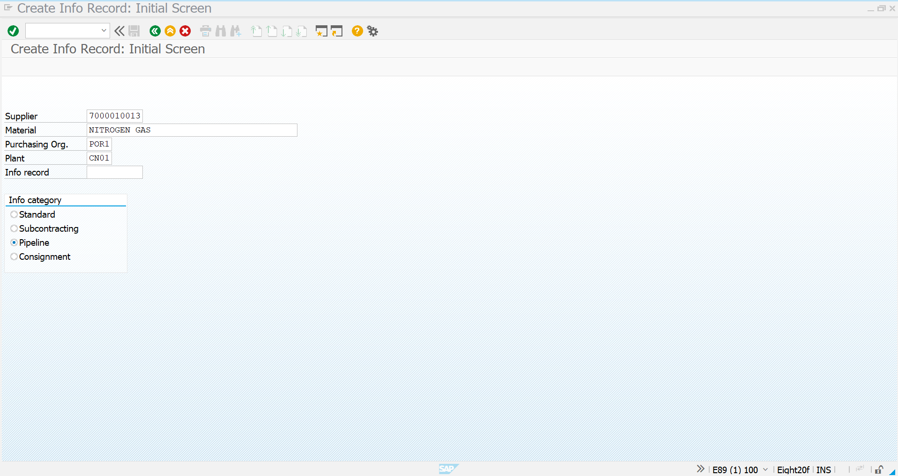
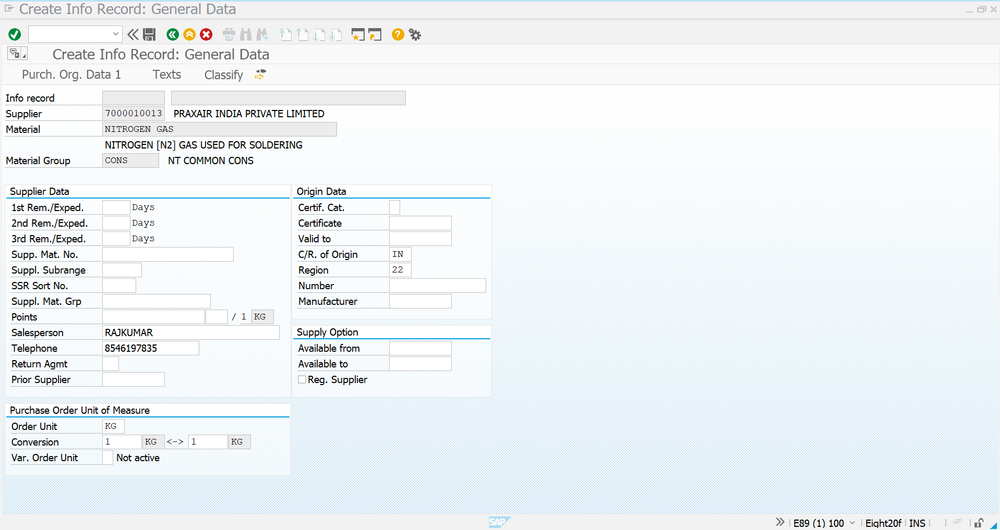
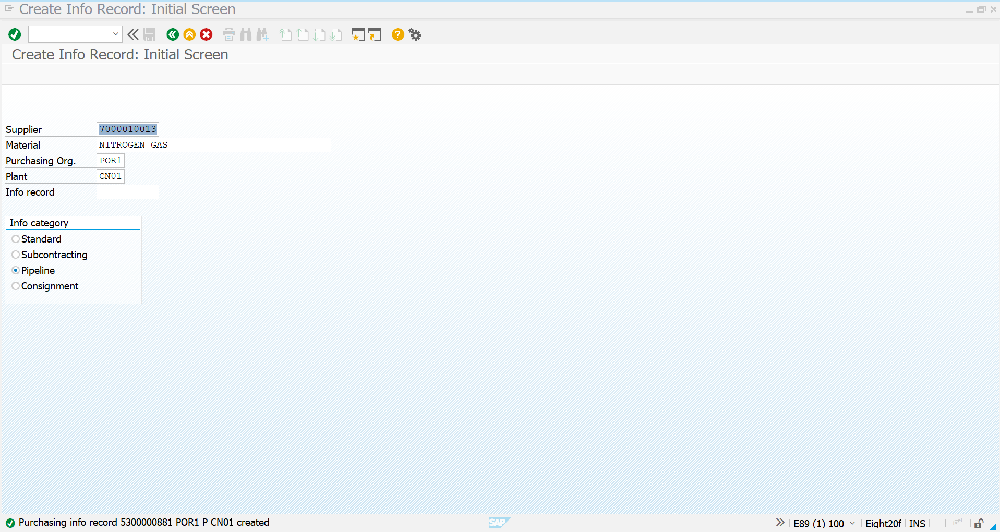
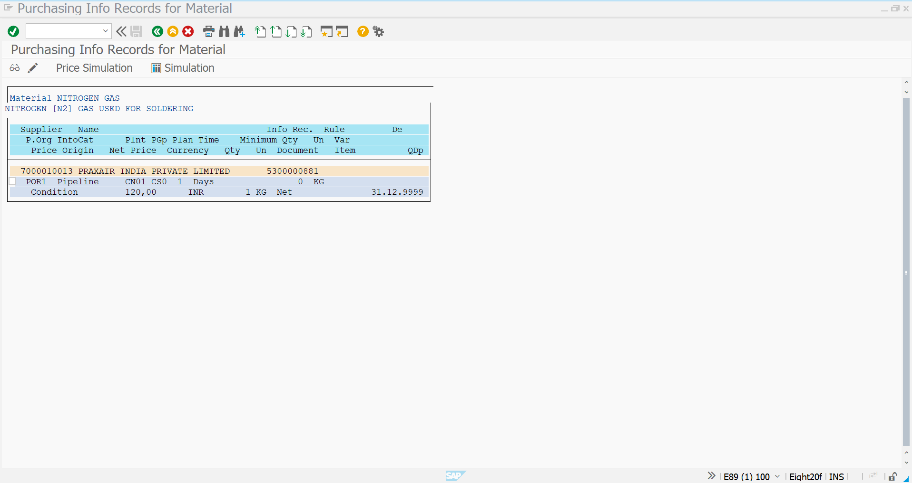

# 📄 Pipeline Purchasing Info Record (ME11)

<p align="center">



</p>

---

# 📌 Document Information

| Item | Details |
|------|----------|
| Module | SAP S/4HANA Materials Management |
| Business Process | Pipeline Procurement |
| Configuration Object | Purchasing Info Record |
| Transaction Code | **ME11** |
| Material | NITROGEN GAS |
| Material Type | PIPE (Pipeline Material) |
| Vendor | PRAXAIR INDIA PRIVATE LIMITED |
| Supplier Number | 7000010013 |
| Purchasing Organization | POR1 |
| Plant | CN01 |
| Info Category | Pipeline |

---

# 🎯 Objective

The Purchasing Info Record establishes the commercial relationship between the **pipeline material** and the **supplier**.

Unlike conventional procurement, pipeline procurement does not require Purchase Orders or Goods Receipts before material consumption. Instead, SAP uses the Pipeline Info Record to determine:

- Supplier
- Price
- Purchasing Organization
- Plant
- Procurement Conditions

during Pipeline Consumption Posting.

---

# 🏭 Business Scenario

Nova Tech Pvt Ltd continuously consumes **Nitrogen Gas (N₂)** supplied by **Praxair India Private Limited** through a dedicated industrial pipeline.

The supplier continuously delivers gas without requiring daily Purchase Orders.

At the end of the settlement period:

- Production reports actual consumption
- SAP records pipeline consumption
- The Pipeline Info Record supplies pricing information
- Vendor settlement is completed through **MRKO**

---

# 🔄 Business Process Flow

```text
Pipeline Vendor
        │
        ▼
Pipeline Material
        │
        ▼
Purchasing Info Record (ME11)
        │
        ▼
Price Determination
        │
        ▼
Pipeline Consumption (MIGO)
        │
        ▼
Settlement (MRKO)
```

---

# ⚙️ SAP Transaction

```
ME11
```

**Create Purchasing Info Record**

---

# 📷 Step 1 – Initial Screen

<p align="center">


</p>

### Master Data Entered

| Field | Value |
|------|-------|
| Supplier | 7000010013 |
| Supplier Name | PRAXAIR INDIA PRIVATE LIMITED |
| Material | NITROGEN GAS |
| Purchasing Organization | POR1 |
| Plant | CN01 |
| Info Category | Pipeline |

---

### Why Pipeline Info Category?

Selecting **Pipeline** informs SAP that:

- No Purchase Order is required
- Material is supplied continuously
- Consumption is recorded directly
- Settlement will occur through MRKO

instead of conventional Invoice Verification.

---

# 📷 Step 2 – General Data

<p align="center">


</p>

General supplier information maintained:

| Field | Value |
|------|--------|
| Salesperson | RAJKUMAR |
| Telephone | 8546197835 |
| Country of Origin | India |
| Region | Tamil Nadu |
| Order Unit | KG |
| Conversion | 1 KG = 1 KG |

---

### Purpose

This information provides:

- Supplier contact information
- Country of Origin
- Unit of Measure consistency
- Procurement master data

for future purchasing activities.

---

# 📷 Step 3 – Purchasing Organization Data

<p align="center">



</p>

Purchasing parameters configured:

| Parameter | Value |
|-----------|---------|
| Planned Delivery Time | 1 Day |
| Purchasing Group | CS0 |
| Standard Quantity | 10 KG |
| Tax Code | V1 |
| Net Price | ₹120 / KG |
| Currency | INR |

---

### Business Significance

Although pipeline materials flow continuously, SAP still maintains procurement parameters including:

- Lead Time
- Purchasing Group
- Tax Determination
- Standard Pricing

These values support accurate valuation and settlement.

---

# 📷 Step 4 – Info Record Created

<p align="center">



</p>

After saving, SAP generated the Pipeline Purchasing Info Record.

Example:

```
5300000881
```

This unique Info Record links:

- Material
- Supplier
- Plant
- Purchasing Organization
- Pricing Conditions

---

# 📷 Step 5 – Display Purchasing Info Record

<p align="center">



</p>

Verification confirms:

| Item | Value |
|------|--------|
| Supplier | PRAXAIR INDIA PRIVATE LIMITED |
| Material | NITROGEN GAS |
| Info Category | Pipeline |
| Purchasing Organization | POR1 |
| Plant | CN01 |
| Net Price | ₹120/KG |

---

# 📊 Integration Architecture

```text
Vendor Master (BP)
          │
          ▼
Material Master
          │
          ▼
Pipeline Purchasing Info Record
          │
          ▼
Pipeline Consumption Posting
          │
          ▼
Accounting Document
          │
          ▼
MRKO Settlement
          │
          ▼
Vendor Payment
```

---

# 🧠 Business Rules

✔ One Pipeline Info Record per Vendor-Material combination.

✔ Pipeline category must be selected during creation.

✔ Price maintained here is automatically used during consumption valuation.

✔ Purchase Orders are not mandatory.

✔ Goods Receipt is replaced by Pipeline Consumption Posting.

✔ Vendor settlement occurs using MRKO.

---

# 📈 Business Benefits

| Traditional Procurement | Pipeline Procurement |
|-------------------------|----------------------|
| Purchase Order Required | Not Required |
| Goods Receipt | Consumption Posting |
| Invoice Verification | Settlement via MRKO |
| Manual Procurement Cycle | Continuous Supply |
| Multiple Documents | Simplified Process |

---

# 💡 Consultant Notes

This Purchasing Info Record serves as the commercial agreement between Nova Tech Pvt Ltd and Praxair India Pvt Ltd for continuous Nitrogen Gas procurement.

SAP automatically references this record during pipeline consumption to determine pricing and supplier information. This eliminates repetitive purchasing activities while ensuring accurate valuation and seamless vendor settlement.

---

# ✅ Result

The Pipeline Purchasing Info Record was successfully created for **Nitrogen Gas**, linking the material with **Praxair India Private Limited**.

The configured pricing and procurement parameters will be automatically utilized during **Pipeline Consumption Posting (MIGO)** and subsequent **Vendor Settlement (MRKO)**, enabling a complete end-to-end Pipeline Procurement process in SAP S/4HANA.

---