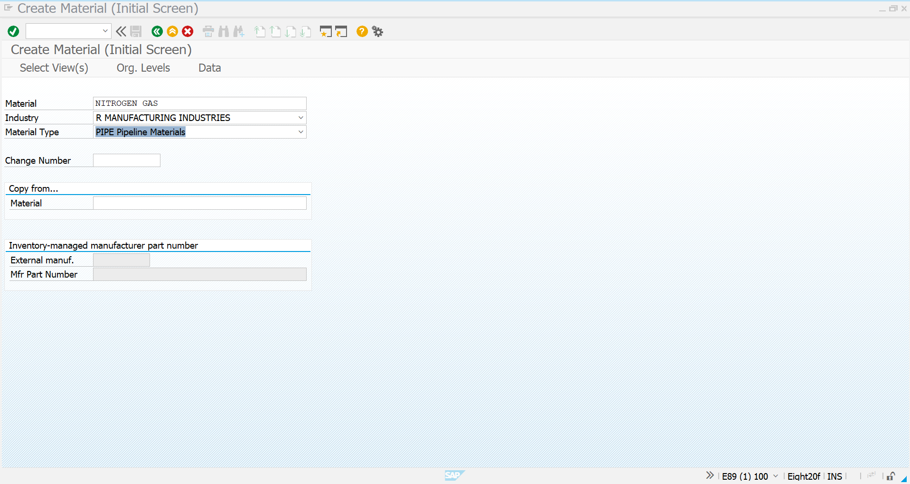
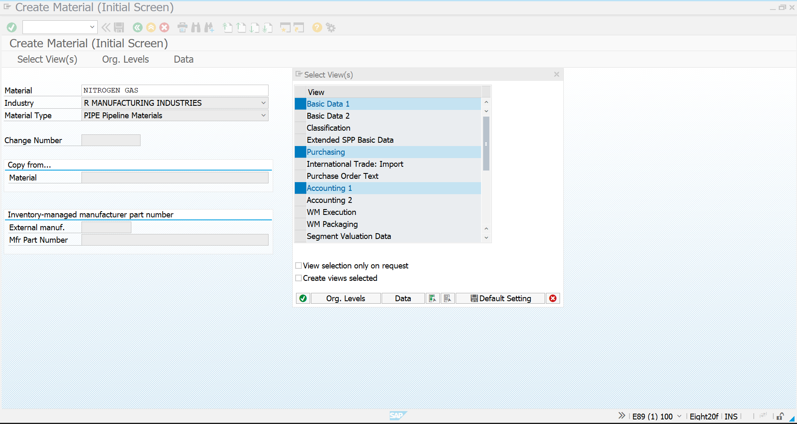
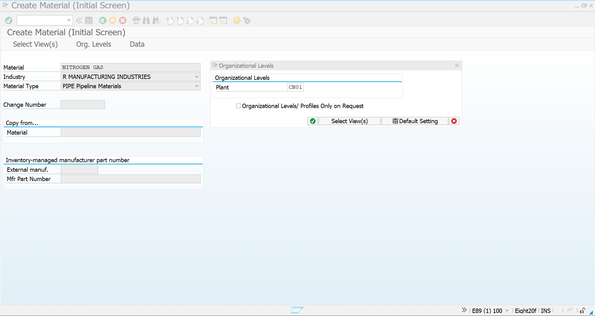
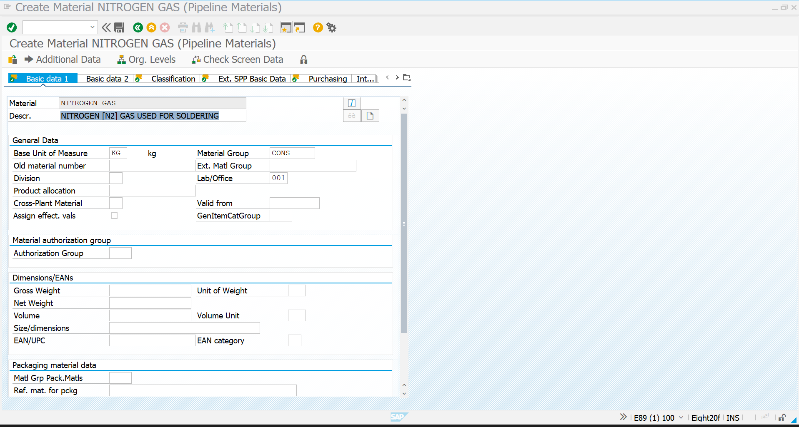
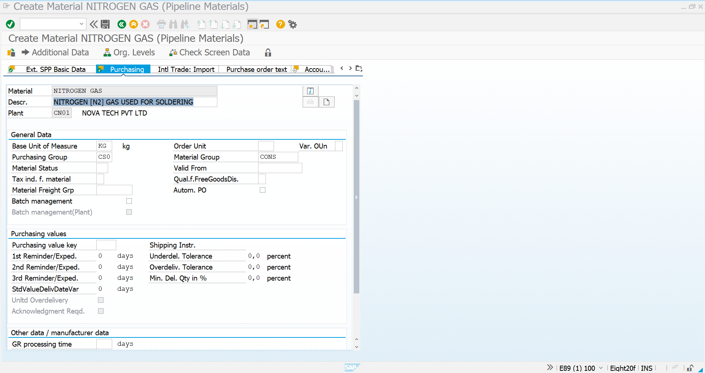
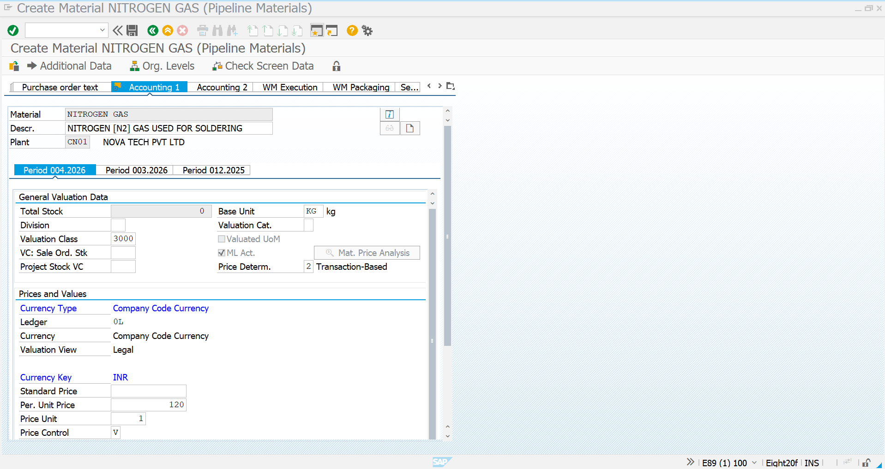
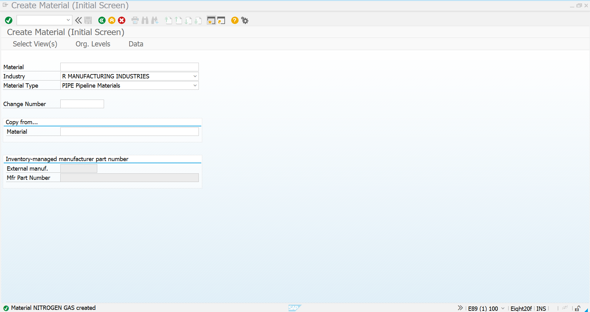

# Pipeline Material Creation

## Overview

The first step in Pipeline Procurement is the creation of a dedicated **Pipeline Material** in SAP S/4HANA MM.

Unlike standard inventory materials, pipeline materials are continuously supplied by the vendor through a physical pipeline without generating individual Purchase Orders for every delivery. Inventory is not received into unrestricted stock through Goods Receipt. Instead, the organization records only the quantity consumed and settles the vendor periodically.

In this business scenario, **Nitrogen (N₂) Gas** is supplied continuously through a pipeline for soldering operations in the manufacturing plant.

---

## Business Requirement

Nova Tech Pvt. Ltd. receives Nitrogen Gas continuously from the pipeline supplier.

The Production Department consumes the gas daily during PCB soldering operations.

Instead of creating a Purchase Order for each delivery, SAP records only the actual consumption and periodically settles the supplier based on the consumed quantity.

---

## SAP Transaction

| Transaction | Description |
|------------|-------------|
| **MM01** | Create Pipeline Material |

---

# Material Details

| Field | Value |
|-------|-------|
| Material | **NITROGEN GAS** |
| Material Type | **PIPE – Pipeline Materials** |
| Industry Sector | **R – Manufacturing Industries** |
| Plant | **CN01 – Nova Tech Pvt Ltd** |
| Base Unit | **KG** |
| Material Group | **CONS** |
| Purchasing Group | **CS0** |
| Valuation Class | **3000** |
| Price Control | **V – Moving Average Price** |
| Price Determination | **2 – Transaction-Based** |

---

# Process Flow

```text
MM01
   │
   ▼
Select Industry Sector
   │
   ▼
Select Material Type (PIPE)
   │
   ▼
Select Required Views
   │
   ▼
Assign Plant
   │
   ▼
Maintain Material Master Data
   │
   ▼
Save Material
   │
   ▼
Pipeline Material Created
```

---

# Step 1 – Initial Material Creation

The material creation process begins by selecting the Industry Sector and the **PIPE (Pipeline Materials)** material type.

### Screenshot



---

# Step 2 – View Selection

The required material master views were selected for maintaining pipeline procurement data.

Selected Views:

- Basic Data 1
- Purchasing
- Accounting 1

### Screenshot



---

# Step 3 – Organizational Levels

The material was assigned to the manufacturing plant.

| Organizational Unit | Value |
|---------------------|-------|
| Plant | **CN01** |

### Screenshot



---

# Step 4 – Basic Data Maintenance

Basic information describing the pipeline material was maintained.

Configured Details:

| Configuration | Value |
|--------------|-------|
| Description | Nitrogen (N₂) Gas Used for Soldering |
| Base Unit | KG |
| Material Group | CONS |

### Screenshot



---

# Step 5 – Purchasing Data

The purchasing view was maintained to support procurement of pipeline materials.

Configured Details:

| Configuration | Value |
|--------------|-------|
| Purchasing Group | CS0 |
| Material Group | CONS |
| Order Unit | KG |

### Screenshot



---

# Step 6 – Accounting Data

Accounting information was maintained for inventory valuation and financial postings.

Configured Details:

| Configuration | Value |
|--------------|-------|
| Valuation Class | 3000 |
| Price Control | V |
| Price Determination | Transaction-Based |

### Screenshot



---

# Step 7 – Material Created Successfully

The material master record was successfully created and is now available for Pipeline Procurement activities.

### Screenshot



---

# Material Configuration Summary

| Configuration | Value |
|--------------|-------|
| Material | NITROGEN GAS |
| Material Type | PIPE |
| Industry Sector | Manufacturing Industries |
| Plant | CN01 |
| Material Group | CONS |
| Purchasing Group | CS0 |
| Base Unit | KG |
| Valuation Class | 3000 |
| Price Control | Moving Average Price |

---

# Business Outcome

- Pipeline material successfully created.
- Material configured for continuous vendor supply.
- Procurement without Purchase Orders enabled.
- Ready for Purchase Info Record configuration.
- Prepared for Pipeline Consumption (Movement Type 201P).
- Supports periodic vendor settlement using MRKO.

---

## Next Step

➡️ **Vendor Master (BP)**

The pipeline supplier Business Partner will be created and extended for Purchasing Organization data before maintaining the Purchase Info Record.