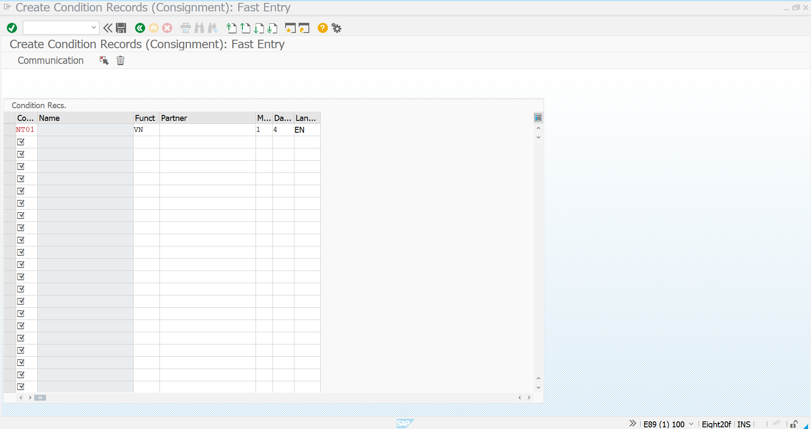
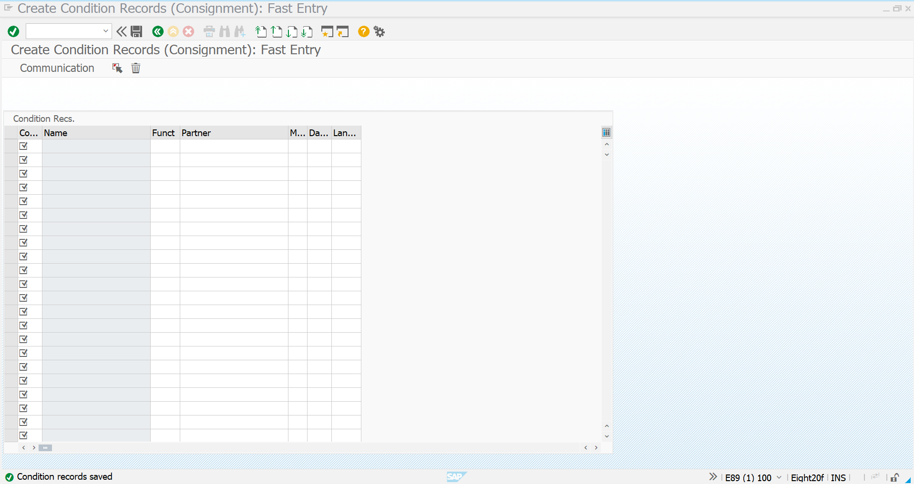
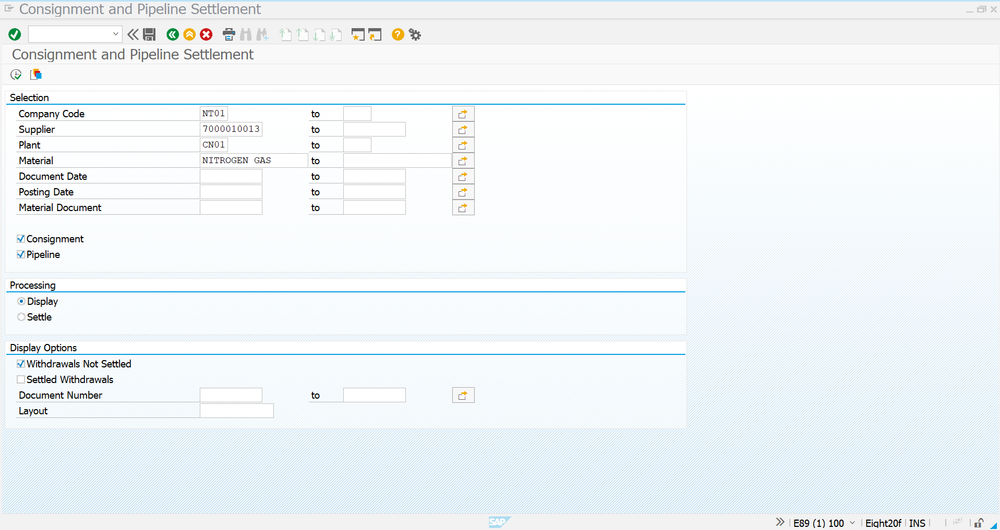
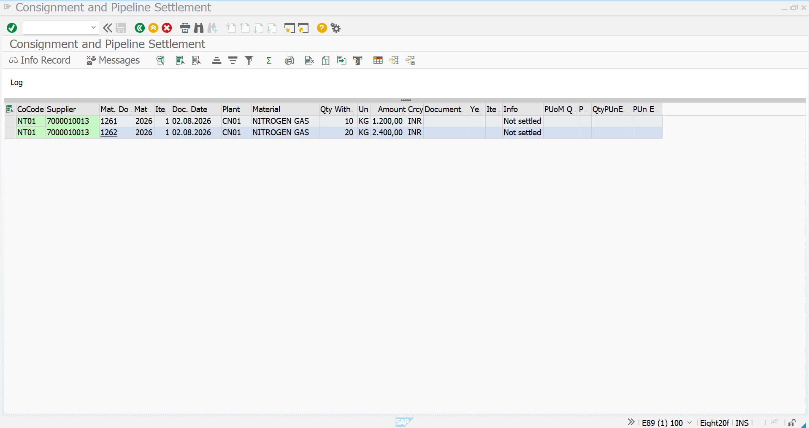
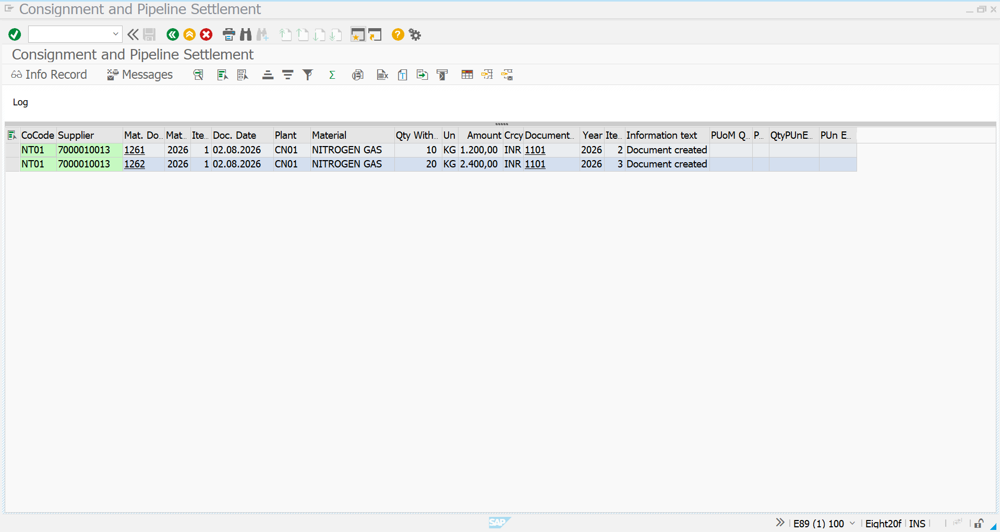

# Pipeline Settlement (MRM1 & MRKO)

## Overview

After the pipeline material is consumed through **MIGO Goods Issue**, SAP settles the consumed quantity with the vendor. The settlement is performed using **MRKO**, which identifies all unsettled pipeline withdrawals and calculates the settlement amount based on the price maintained in the Pipeline Info Record.

Before executing settlement, an output condition record is maintained using **MRM1**.

---

# Step 1 – Maintain Output Condition Record

## Transaction Code

```text
MRM1
```

## Purpose

Create the output condition record required for pipeline settlement.

## Procedure

1. Execute transaction **MRM1**.
2. Enter the required output condition details.
3. Maintain the communication settings.
4. Save the condition record.

## Screenshot



---

# Step 2 – Output Condition Record Created

The output condition record has been created successfully and is now available for settlement processing.

## Screenshot



---

# Step 3 – Execute Pipeline Settlement

## Transaction Code

```text
MRKO
```

## Purpose

Display all unsettled pipeline withdrawals and prepare them for settlement.

## Procedure

1. Execute transaction **MRKO**.
2. Enter the Company Code.
3. Enter the Supplier.
4. Enter the Plant.
5. Enter the Pipeline Material.
6. Select the **Pipeline** checkbox.
7. Select **Withdrawals Not Settled**.
8. Click **Execute (F8)**.

## Screenshot



---

# Step 4 – Settlement Preview

SAP displays all unsettled pipeline consumption documents along with the withdrawal quantity and settlement amount.

Verify the following details before settlement:

- Company Code
- Supplier
- Material
- Withdrawal Quantity
- Settlement Amount

## Screenshot



---

# Step 5 – Settlement Posted

After settlement is executed, SAP creates the settlement document and marks the pipeline withdrawals as settled.

The settlement amount is calculated automatically using the price maintained in the Pipeline Info Record.

## Screenshot



---

# Result

The Pipeline Procurement cycle is completed successfully.

The following activities have been completed:

- Output condition record maintained using **MRM1**.
- Pipeline withdrawals identified using **MRKO**.
- Settlement amount calculated automatically.
- Settlement document created successfully.
- Pipeline consumption marked as settled.