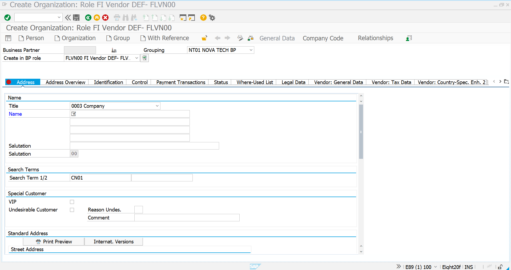
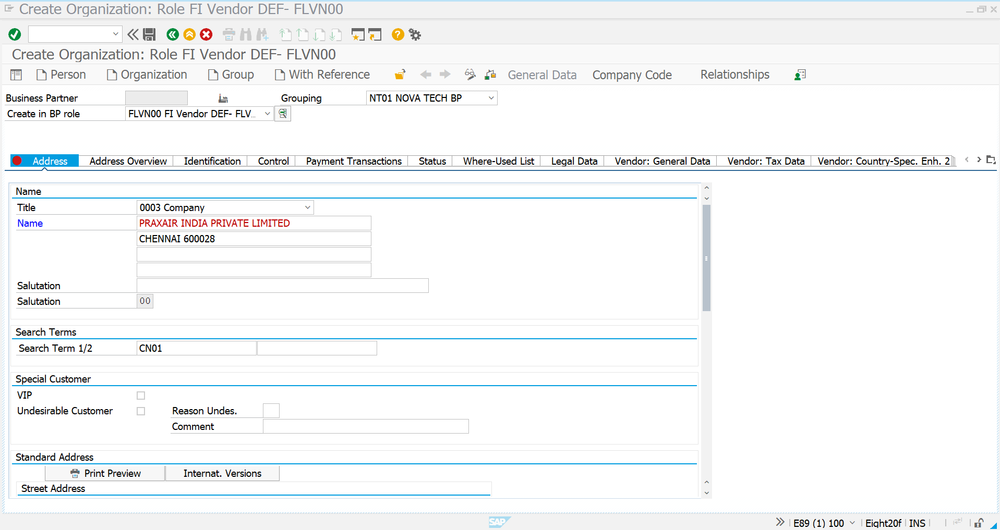
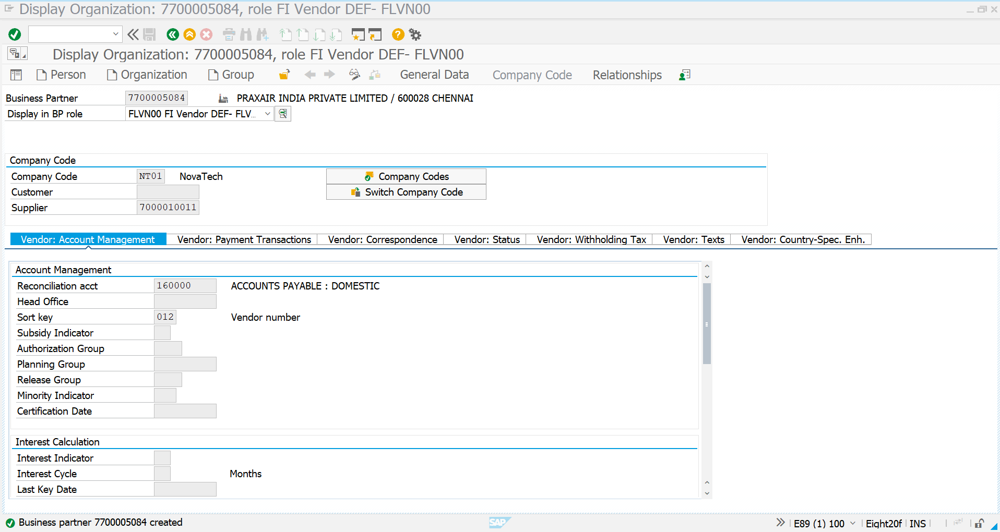
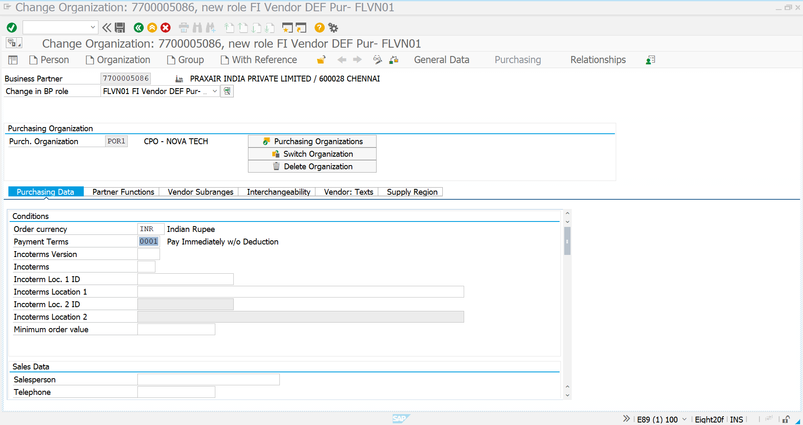
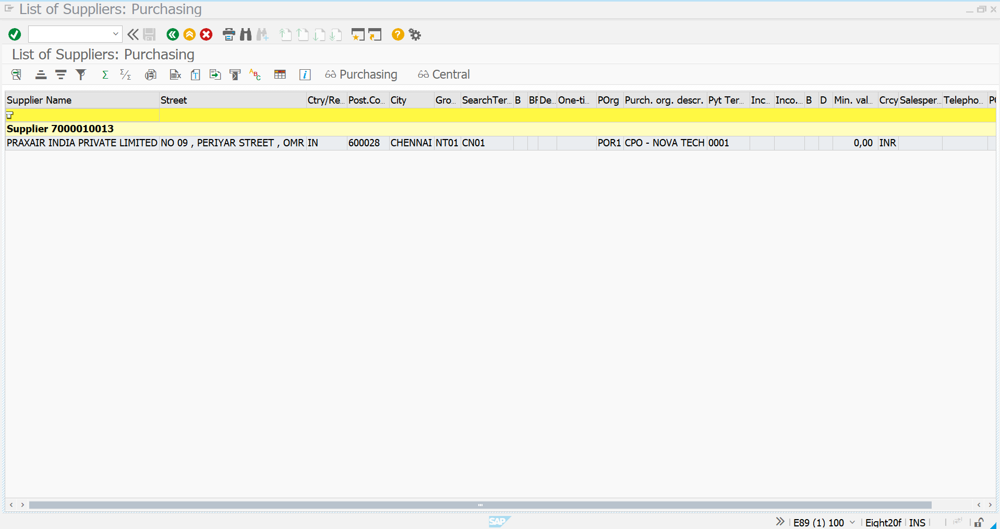

# Vendor Master Creation for Pipeline Procurement

> **Phase 07 – Advanced SAP MM Scenarios**  
> **Scenario:** Pipeline Procurement  
> **Module:** SAP S/4HANA Materials Management (MM)  
> **Business Partner:** Supplier Master Creation

---

# Overview

Pipeline Procurement requires a supplier that continuously provides consumable materials directly to the manufacturing process without receiving conventional Purchase Orders or Goods Receipts.

In this implementation, **PRAXAIR INDIA PRIVATE LIMITED** has been configured as the Pipeline Vendor responsible for supplying Nitrogen Gas to NovaTech's manufacturing plant.

The supplier is maintained as a **Business Partner (BP)** using the SAP S/4HANA Business Partner approach and extended to both:

- FI Vendor
- Purchasing Vendor

This enables SAP to perform automatic settlement of consumed quantities using **MRKO**.

---

# Business Requirement

NovaTech Electronics Manufacturing Pvt. Ltd. consumes Nitrogen Gas every day through an industrial pipeline connected directly to its production facility.

Unlike normal procurement,

- No Purchase Order is generated.
- No Goods Receipt is posted for incoming deliveries.
- Materials are consumed immediately.
- Finance settles the supplier periodically based on actual consumption.

To support this process, the supplier must be configured as a Business Partner with both Financial Accounting and Purchasing views.

---

# SAP Transactions

| Activity | Transaction |
|-----------|------------|
| Create Business Partner | BP |
| Display Business Partner | BP |
| Display Supplier List | FL93 |
| Settlement | MRKO |

---

# Pipeline Vendor Information

| Configuration | Value |
|--------------|-------|
| Vendor Name | PRAXAIR INDIA PRIVATE LIMITED |
| Business Partner Role | FLVN00 |
| Purchasing Role | FLVN01 |
| Company Code | NT01 |
| Purchasing Organization | POR1 |
| Currency | INR |
| Payment Terms | 0001 |
| City | Chennai |
| Search Term | CN01 |

---

# Business Flow

```text
Nitrogen Gas Supplier
        │
        ▼
Business Partner (BP)
        │
        ▼
FI Vendor (FLVN00)
        │
        ▼
Purchasing Vendor (FLVN01)
        │
        ▼
Pipeline Info Record
        │
        ▼
Pipeline Consumption
        │
        ▼
MRKO Settlement
```

---

# Implementation Process

---

# Step 1 – Create Business Partner

## Transaction

```text
BP
```

A new Business Partner was created using the FI Vendor role.

The supplier grouping was selected as:

```text
NT01 NOVA TECH BP
```

This ensures that the supplier belongs to the NovaTech enterprise structure.

---

## Configuration

| Field | Value |
|-------|-------|
| BP Role | FLVN00 |
| Grouping | NT01 NOVA TECH BP |
| Organization Type | Organization |

---

## Screenshot



---

# Step 2 – Maintain General Data

The supplier's organizational information was maintained.

General information includes

- Supplier Name
- Search Term
- Address
- City
- Postal Code
- Country

This information is shared across all SAP modules.

---

## General Data

| Field | Value |
|-------|-------|
| Supplier Name | PRAXAIR INDIA PRIVATE LIMITED |
| Search Term | CN01 |
| City | Chennai |
| Postal Code | 600028 |

---

## Screenshot



---

# Step 3 – Maintain Company Code Data

The supplier was extended to Company Code **NT01**.

Financial Accounting settings enable SAP to manage

- Accounts Payable
- Vendor Reconciliation
- Payment Processing
- Financial Settlement

---

## Company Code Configuration

| Configuration | Value |
|--------------|-------|
| Company Code | NT01 |
| Reconciliation Account | 160000 |
| Sort Key | 012 |

---

## Screenshot



---

# Step 4 – Maintain Purchasing Organization Data

The supplier was assigned to Purchasing Organization **POR1**.

Purchasing data determines how procurement transactions interact with the supplier.

---

## Purchasing Configuration

| Field | Value |
|-------|-------|
| Purchasing Organization | POR1 |
| Currency | INR |
| Payment Terms | 0001 |
| Purchasing Role | FLVN01 |

---

## Screenshot



---

# Step 5 – Verify Supplier Creation

After saving the Business Partner, the supplier was successfully created and verified.

The supplier is now available for procurement activities and Pipeline Procurement settlement.

---

## Screenshot



---

# Configuration Summary

| Configuration Area | Status |
|-------------------|--------|
| Business Partner Created | ✅ Completed |
| FI Vendor Extended | ✅ Completed |
| Purchasing Vendor Extended | ✅ Completed |
| Company Code Assigned | ✅ Completed |
| Purchasing Organization Assigned | ✅ Completed |
| Payment Terms Maintained | ✅ Completed |
| Supplier Available | ✅ Completed |

---

# Business Impact

The Pipeline Vendor configuration enables SAP to

- Manage continuous material suppliers
- Support automatic Pipeline Procurement
- Integrate Procurement with Finance
- Enable periodic vendor settlement
- Eliminate traditional Purchase Orders for pipeline materials
- Improve procurement automation

---

# Process Position

```text
Business Scenario
        │
        ▼
Material Creation
        │
        ▼
Vendor Master     ✅
        │
        ▼
Pipeline Info Record
        │
        ▼
Cost Center
        │
        ▼
Pipeline Consumption
        │
        ▼
MRM1 Output
        │
        ▼
MRKO Settlement
```

---

# Key Deliverables

| Deliverable | Status |
|------------|--------|
| Pipeline Supplier Created | ✅ |
| Business Partner Configured | ✅ |
| Purchasing Organization Assigned | ✅ |
| Company Code Assigned | ✅ |
| Supplier Ready for Pipeline Procurement | ✅ |

---

# Conclusion

The Pipeline Vendor has been successfully configured using the SAP S/4HANA Business Partner approach.

This supplier will be referenced during Pipeline Procurement through the Pipeline Info Record and will participate in periodic settlement based on actual material consumption using **MRKO**.

The implementation follows SAP best practices for continuous utility procurement in manufacturing environments.

---
